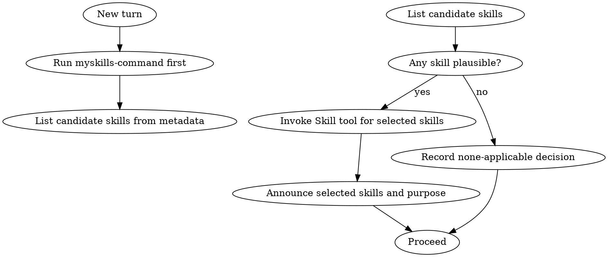

# MySkills Command

Treat this as a rigid, always-first process skill.

<EXTREMELY-IMPORTANT>
If there is even a small chance a skill applies, invoke it.

If a skill applies, you do not have a choice. You must use it.

Do not answer, ask clarifying questions, run tools, or edit files before this check.

This is not negotiable. This is not optional.
</EXTREMELY-IMPORTANT>

## Mission

Run mandatory skill gating before any action.
Decide which skills to invoke with conservative bias.
Force disciplined ordering when multiple skills apply.
Create an auditable decision record.

## Non-Negotiable Rules

1. Run this skill first on every turn.
2. Do not answer, ask clarification, run tools, or edit files before this check.
3. Invoke the `Skill` tool before any response when a skill is plausible.
4. Use conservative threshold: uncertain means invoke.
5. Do not skip a skill because the task looks simple.
6. If user names a skill, invoke it.
7. If multiple skills apply, run process skills before implementation skills.

## Decision Workflow



## Skill Selection Algorithm

1. Parse user intent and requested outcome.
2. Match intent against available skill descriptions.
3. Add any user-named skills.
4. Apply conservative threshold: if unsure, include.
5. Sort selected skills by order:
   - Process skills first (brainstorming, debugging, planning, verification).
   - Implementation/domain skills second.
   - Finalization/review skills last.
6. Invoke in sorted order.

## Anti-Rationalization Checks

If any of these appear, stop and re-run selection:

| Thought | Reality |
|---------|---------|
| "This task is too small for a skill." | Small tasks still drift without process. |
| "I will do one quick thing first." | Any action before check violates policy. |
| "I remember the skill already." | Skills evolve; invoke current version. |
| "I need to inspect files before deciding." | Skill check is first, then inspection. |
| "User did not explicitly ask for skills." | Implicit applicability still requires invocation. |

## Observable Enforcement

Prefer machine-readable telemetry in this order:

1. Runtime event hooks:
   - `skill_check_start`
   - `skill_candidates`
   - `skill_invoked`
   - `skill_check_end`
2. If hooks are unavailable but shell access exists, append one JSON line to local audit log.
3. If neither is possible, emit a short visible `skill-decision` block before the first action.

Recommended decision payload fields:

- `turn_id`
- `user_goal`
- `candidates`
- `selected`
- `reason`
- `timestamp_utc`

## Output Contract

Before first action in a turn, expose one of:

- Event stream (preferred), or
- JSON log line, or
- Visible block:

```text
[skill-decision]
selected: [...]
reason: ...
[/skill-decision]
```

## Failure Handling

If telemetry hooks are unavailable:

1. Emit visible `[skill-decision]` block before any action.
2. If block emission fails or is missing, retry one time.
3. If retry fails, stop and return explicit policy error instead of continuing silently.

## Conflict Handling

If two skills conflict:

1. Prefer stricter process discipline.
2. Prefer user-explicit skill mention over implicit inference.
3. Do not drop safety/verification skills.
4. Record conflict and chosen resolution in decision payload.

## Completion Condition

This skill has completed only when:

1. Selection is recorded.
2. Required downstream skills are invoked in order.
3. Only then may task execution continue.
