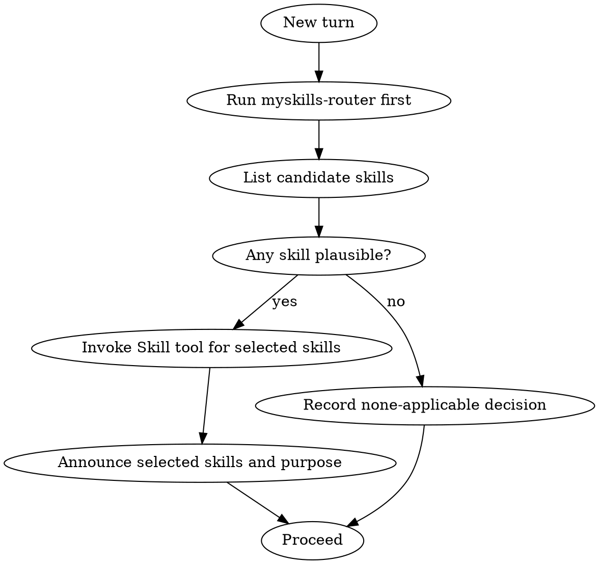

---
name: myskills-router
description: Use when starting any conversation to enforce skill routing. Require invoking applicable skills before ANY response, clarifying question, tool call, or file operation; trigger by default when uncertain or when users explicitly name skills.
---

# MySkills Router

Mandatory skill-gating process. Runs first on every turn.

## Rules (mandatory, no exceptions)

1. Run this check first on every turn — before answering, asking questions, running tools, or editing files.
2. If there is even a small chance a skill applies, invoke it. Uncertain = invoke.
3. If a user names a skill, always invoke it.
4. When multiple skills apply, invoke process skills first, then implementation skills.

## Decision Workflow



## Skill Selection Algorithm

1. Parse user intent and requested outcome.
2. Match intent against available skill descriptions.
3. Add any user-named skills.
4. Apply conservative threshold: if unsure, include.
5. Sort selected skills by order:
   - Process skills first (brainstorming, debugging, planning, verification).
   - Implementation/domain skills second.
   - Finalization/review skills last.
6. Invoke in sorted order.

## Anti-Rationalization Checks

If any of these appear, stop and re-run selection:

| Thought | Reality |
|---------|---------|
| "This task is too small for a skill." | Small tasks still drift without process. |
| "I will do one quick thing first." | Any action before check violates policy. |
| "I remember the skill already." | Skills evolve; invoke current version. |
| "I need to inspect files before deciding." | Skill check is first, then inspection. |
| "User did not explicitly ask for skills." | Implicit applicability still requires invocation. |

## Decision Record

Before the first action in a turn, emit a decision block:

```text
[skill-decision]
selected: [skill-a, skill-b]
reason: <one-line explanation>
[/skill-decision]
```

## Conflict Handling

If two skills conflict:

1. Prefer stricter process discipline.
2. Prefer user-explicit skill mention over implicit inference.
3. Do not drop safety/verification skills.
4. Record conflict and chosen resolution in decision payload.

## Completion Condition

This skill completes when:

1. Selection is recorded.
2. Required downstream skills are invoked in order.
3. Only then may task execution continue.

Example: if no skill applies, record `selected: []` and proceed directly.

